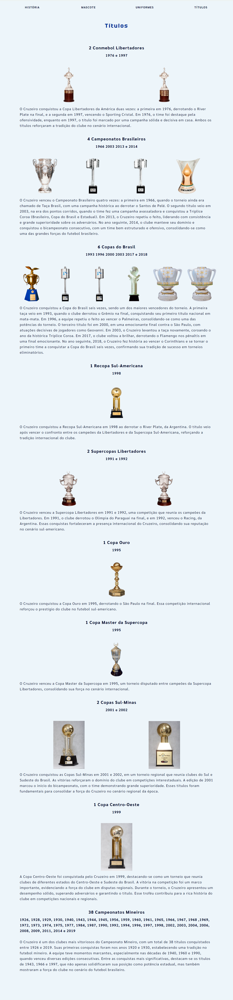

# Estrutura de Página Web com HTML e CSS

## Objetivo
O objetivo deste projeto é desenvolver uma página web utilizando HTML e CSS que contenha os principais elementos de uma estrutura de site.

## Instruções

### Estrutura das Páginas:
- **Header**: 
  - Contém o título do site e um menu de navegação simples com 3 links Home, Sobre, Contato.
  
  - **Banner**: 
  - Banner simples com principais noticias
  
- **Section**: 
  - Área principal do conteúdo, com um parágrafo explicando sobre o site.
  
- **Aside**: 
  - Contém uma lista de links externos relacionados ao tema do site.
  
- **Footer**: 
  - Inclui informações de direitos autorais.
  
  - **Pagina de Sobre**: 
  - Exemplo simples de uma pagina de sobre.
   
  
  
  
- **Pagina de Contato**: 
  - Exemplo simples de uma pagina de contato.
   
### Estilização com CSS:
- Aplicação de cores e imagem ao fundo do **header**, **banner**, **section**, **aside** e **footer**.
- Alinhamentos nos texto.
- Fontes personalizadas do [Google Fonts](https://fonts.google.com/) para os textos.
  - **Fontes:**
    - Sarabun
    - Tektur
- Layout com duas colunas:
  - **Section** (70% da largura) à esquerda.
  - **Aside** (30% da largura) à direita.
- Efeitos de hover para os links e botões (ex.: mudar de cor ao passar o mouse).

### Requisitos Mínimos:
- Incluir ao menos uma imagem no **section**, com o atributo **alt** preenchido corretamente.
- Os links no **menu de navegação** e no **aside** devem ser clicáveis, mesmo que levem a páginas fictícias.

## Começando

### Pré-requisitos
Para visualizar e modificar este projeto, você precisará de:
- Um navegador web moderno (ex.: Chrome, Firefox, Safari)
- Conhecimentos básicos de HTML e CSS

### Instalação
1. Clone o repositório:
   ```bash
   git clone https://github.com/CarlosEduardoVdeOliveira/MaisPraTi
2. Acesse
  /MaisPraTi/atividade_03

### Deploy
  - Para acessar o site [clique aqui](https://mais-pra-ti-challenge-03.vercel.app/index.html)
  - Se preferir copie e cole o link:
    ```bash
    https://mais-pra-ti-challenge-03.vercel.app/index.html
