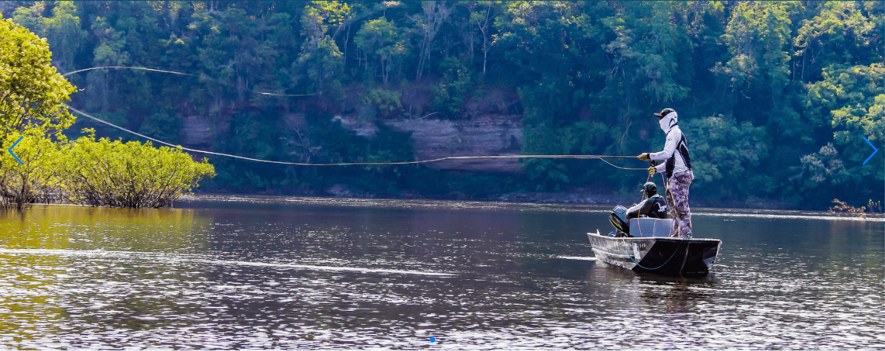
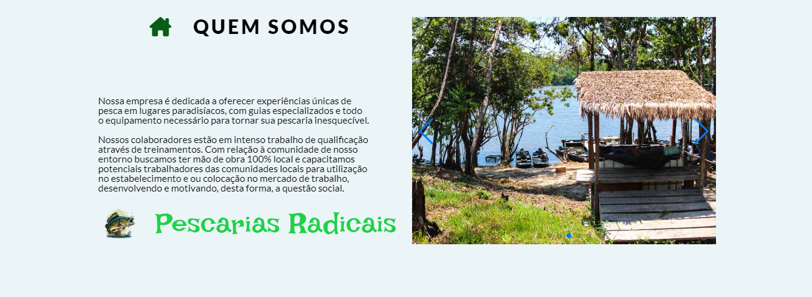
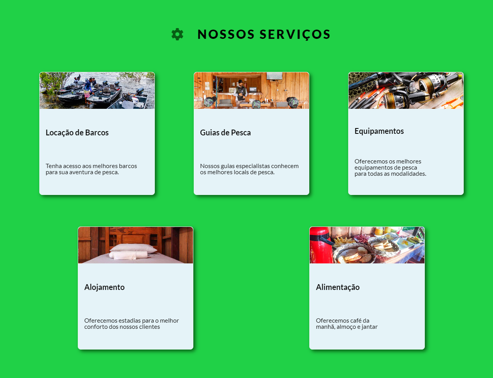
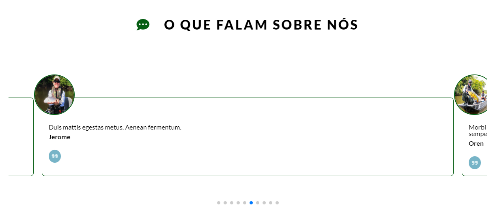
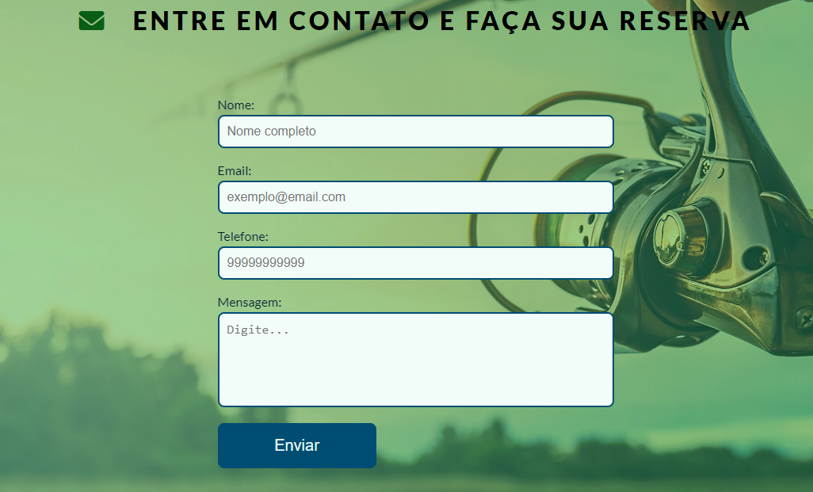

# Pescarias Radicais - Landing Page

## Descrição

Este projeto é uma landing page moderna desenvolvida para uma empresa que oferece atividades de pesca radical. A página utiliza HTML, CSS, JavaScript, e diversas bibliotecas externas para criar uma experiência interativa e dinâmica. Elementos como sliders, depoimentos e formulários de contato são alimentados por APIs, proporcionando uma interface responsiva e acessível.

## Tecnologias Utilizadas

- **HTML5**: Para estruturação da página.
- **CSS3**: Para estilização, com uso de media queries para responsividade.
- **JavaScript (ES6)**: Para funcionalidade interativa, validação de formulários, e consumo de APIs.
- **Swiper.js**: Biblioteca usada para o carrossel/slider de imagens.
- **AOS.js**: Usada para animações ao rolar a página, especialmente na seção de depoimentos.
- **lightGallery**: Para visualização de imagens em formato de galeria.
- **EmailJS**: Para envio de emails diretamente pelo formulário de contato.
- **Font Awesome**: Ícones utilizados na navegação e em elementos interativos.
- **Google Fonts**: Tipografias "Lato" e "Irish Grover" para uma aparência moderna e amigável.

## Funcionalidades

### Estrutura da Página:

1. **Header**:
   - Contém o logo da empresa e um menu de navegação para as seções "Sobre", "Serviços", "Testemunhos" e "Contato".
   
   

2. **Banner Principal (Slider)**:
   - Carrossel interativo destacando os principais serviços da empresa com navegação via botões.
   - Implementado com **Swiper.js**.
   
3. **Seção "Sobre"**:
   - Breve introdução à empresa e seus serviços com texto descritivo.
   
4. **Seção "Serviços"**:
   - Cards descrevem os principais serviços oferecidos.
   
5. **Seção "Testemunhos"**:
   - Depoimentos dinâmicos de clientes consumidos de uma API personalizada.
   - Cada depoimento exibe o nome, foto e mensagem do cliente.
   
6. **Seção "Contato"**:
   - Formulário de contato com validação de campos (nome, email, telefone, mensagem).
   - Integração com **EmailJS** para envio de dados diretamente para um email.
   
7. **Footer**:
   - Links para as redes sociais e informações de política de privacidade.
   

### Validação de Formulário

A validação de formulário é realizada em JavaScript para garantir que todos os campos (nome, email, telefone e mensagem) sejam preenchidos corretamente antes do envio.

### Consumo de APIs

- **Depoimentos**: API personalizada com depoimentos, incluindo id, nome, imagem do cliente e mensagem.

### Slider Interativo

O slider foi implementado utilizando **Swiper.js**, proporcionando uma navegação suave entre os slides, com botões de controle e indicadores visuais.

### Design Responsivo

- O layout da página é totalmente responsivo, adaptando-se a diferentes tamanhos de tela (desktop, tablet e smartphone).
- A responsividade foi implementada com **CSS Media Queries**.

## Bibliotecas Externas Utilizadas

- **Swiper.js**: [Swiper.js](https://swiperjs.com/)
- **AOS.js**: [AOS.js](https://michalsnik.github.io/aos/)
- **lightGallery**: [lightGallery](https://www.lightgalleryjs.com/)
- **Font Awesome**: [Font Awesome](https://fontawesome.com/)
- **EmailJS**: [EmailJS](https://www.emailjs.com/)

## Github

1. Clone o repositório:
   ```bash
   git clone https://github.com/CarlosEduardoVdeOliveira/MaisPraTi.git
   ```

2. Navegue até o diretório do projeto:
   ```bash
   cd /MaisPraTi/atividade_04
   ```

3. Abra o arquivo `index.html` no navegador de sua escolha.

### Deploy
  - Para acessar o site [clique aqui](https://mais-pra-ti-challenge-03.vercel.app/index.html)
  - Se preferir copie e cole o link:
    ```bash
    https://mais-pra-ti-challenge-03.vercel.app/index.html