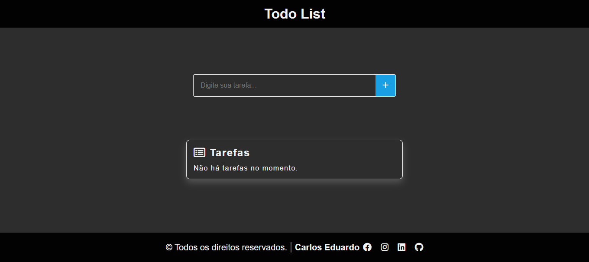
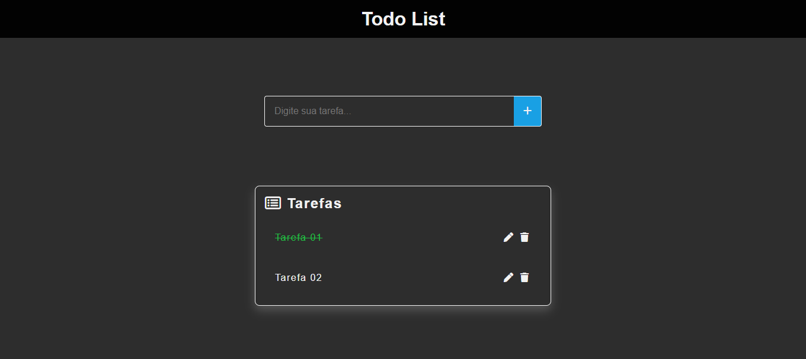
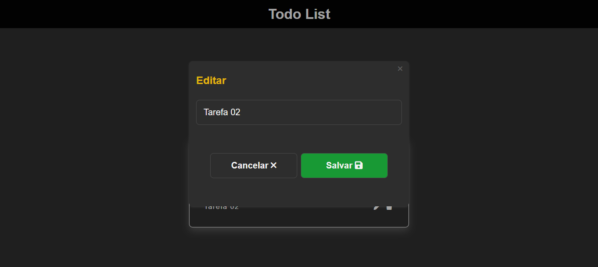

# 📝 Aplicação To-Do List

Uma aplicação simples e interativa de To-Do List desenvolvida com HTML, CSS e JavaScript. Este projeto permite que os usuários gerenciem suas tarefas diárias de forma eficiente, com funcionalidades como adicionar, editar, excluir e marcar tarefas como concluídas.

## 🚀 Funcionalidades

Adicionar novas tarefas: Adicione tarefas à sua lista rapidamente.
Editar tarefas: Atualize a descrição de qualquer tarefa com facilidade.
Excluir tarefas: Remova tarefas que não são mais necessárias.
Marcar como concluída: Clique no texto da tarefa para alternar entre os status em progresso e concluído.
Armazenamento persistente: As tarefas são salvas no localStorage do navegador para garantir que não sejam perdidas após recarregar a página.

## 🛠️ Instalação

- Clone o repositório:

  ```bash
    git clone https://github.com/seu-usuario/todo-list-app.git
    cd todo-list-app
  ```

  Abra o arquivo index.html no seu navegador para começar a usar a aplicação.

## 📸 Capturas de Tela

- ## Interface Principal

  

- ## Tarefas

  

- ## Modal edit
  

## 🤝 Contribuindo

Fique à vontade para fazer um fork do repositório e enviar pull requests. Toda contribuição é bem-vinda!

### Deploy

- Para acessar a aplicação [clique aqui](https://to-do-list-five-chi-59.vercel.app/)
- Se preferir copie e cole o link:
  ```bash
  https://to-do-list-five-chi-59.vercel.app/
  ```
